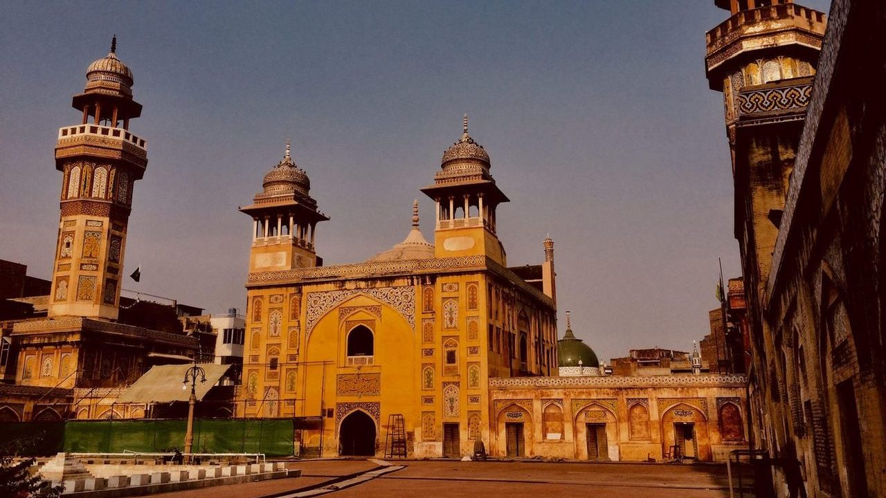
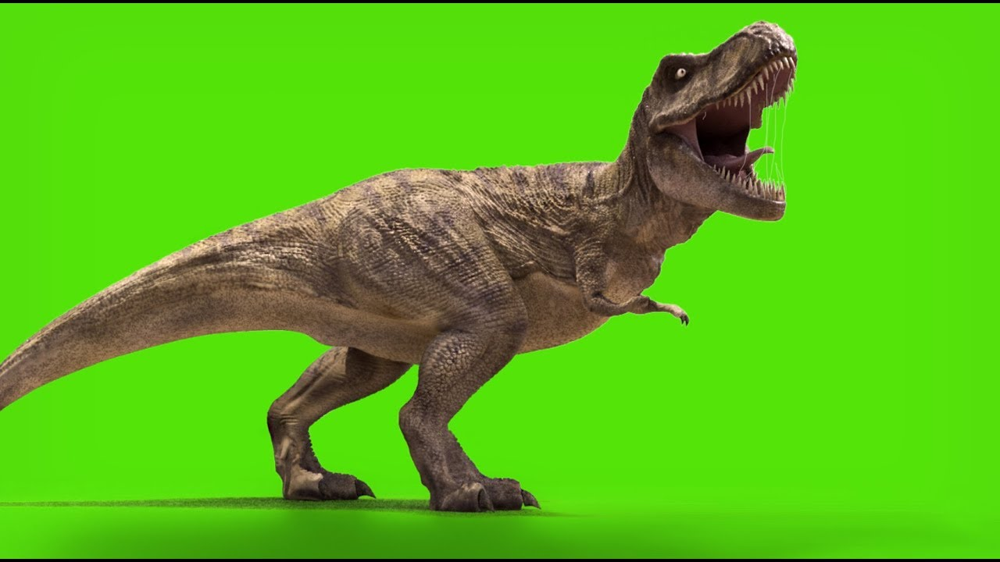
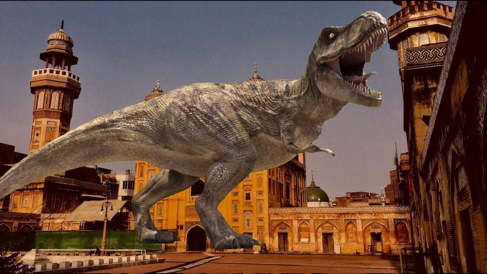

# GreenScreenWiper

Piss shrimple Computer Vision project that takes a green-screen image and a background as input and outputs another image with the subject of the green-screen object overlayed onto the background. I haven't tested it for images of different sizes but it'll work. Probably.

<p align="center">
  
  
  
</p>

## Usage

```bash
git clone https://github.com/masroof-maindak/GreenScreenWiper.git
cd GreenScreenWiper
mkdir build && cd build
cmake -DCMAKE_BUILD_TYPE=Release .. # Or 'Debug' if you want to hack away.
cmake --build .

./gsw <input-img-path> <background-img-path> <output-img-path>
```

## Dependencies

- OpenCV
- QT6
- VTK
- HDF5

#### Arch Linux

```bash
sudo pacman -S opencv qt6-base vtk hdf5
```
